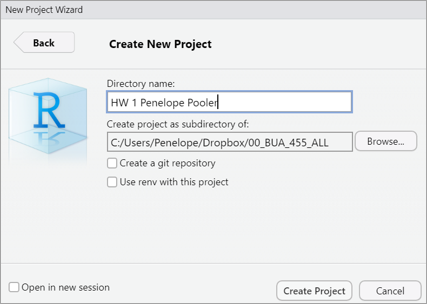
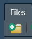
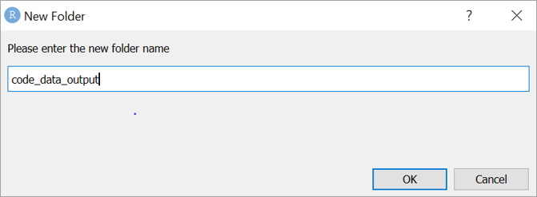
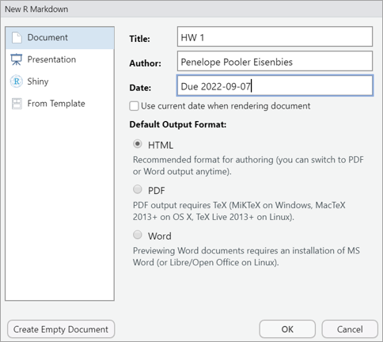
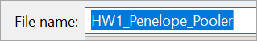
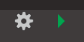
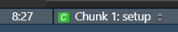

```{r setup, include=TRUE}

# this line specifies options for default options for all R Chunks
knitr::opts_chunk$set(echo=T, highlight=T,
                      scipen=100,          # suppresses scientific notation
                      echo = TRUE)

# suppress scientific notation
options(scipen=100)

# install helper package that loads and installs other packages, if needed
if (!require("pacman")) install.packages("pacman", repos = "http://lib.stat.cmu.edu/R/CRAN/")

# install and load required packages
# flexdashboard not required for today, but make sure you can install and load it
pacman::p_load(pacman,tidyverse, gridExtra, magrittr)

# verify packages
p_loaded()

```


### Course Background

#### REQUIRED Pre-class Information

- If you haven't already read through the **[Pre-class Information](add google link)**, please do.

---

### Syllabus

- The **[Syllabus](https://docs.google.com/document/d/1jXKwH_IKJ3CXt5uFWiGGODBrwIjPlXHK/edit?usp=sharing&ouid=105789079702095490344&rtpof=true&sd=true)** is available as a Google Doc link on Blackboard.

- If substantial changes are made, I will post an announcement on Blackboard.

---

### Information about R and R Studio

- Pre-class Information Videos are available in Kaltura Channel for this course: **[BUA 455 - Spring 2022](https://video.syr.edu/channel/BUA%2B455%2B-%2BSpring%2B2022/243108882)**
 
- Additional Resources: textbook sections and Linkedin Learning videos in **[Pre-class Information](https://rpubs.com/PeneLope_PE/857533)**.

- **R/RStudio Resources section** on the Blackboard site for the course includes:

  - **[Tutorial videos](https://blackboard.syracuse.edu/webapps/blackboard/content/listContentEditable.jsp?content_id=_7736517_1&course_id=_463381_1&mode=reset)** (I will add more)
  - A curated list of **[text resources](https://docs.google.com/document/d/1qdqO7MTq7scYhFydkJuhA7JIUVQNldNXqMBOspXlNZk/edit?usp=sharing)** I have created for BUA 455
  - A curated list of **[video resources](https://docs.google.com/document/d/15y4fVHQA2JKUWy7X188Qn8Ph1V-VtLKsjOhubFv6SuI/edit?usp=sharing)** I have created for BUA 455 
  
<br>

### HW 1 - Part 1

**This Blackboard Assignment counts as 20% of HW 1.**

- It includes six questions about:
  - Some course policies from the syllabus
  - The hardware requirements for this course (not negotiable)
  - The current version of R and RStudio

---

### Week 1 In-class Exercises (TP L1 - Q1)

***TurningPoint Session ID: bua455s22***

**This is also Question 6 of HW 1 - Part 1**

Each version of R is given a unique name to differentiate them. 

What is the current version of R (and hopefully the version on your computer) called?

- Kick Things
- Camp Pontanezen
- One Push-up
- Bird Hippie
- Vigorous Calisthenics
- Shake and Throw


See provided **[tutorial videos]()**, for information in installing (or reinstalling) R and RStudio.

<br>

**NOTE:** R updates to a new version two or three times each year. 

**When a new version is released:** Delete the old version and download and install the new version of R as soon as possible.

---

### HW 1 - Parts 2 and 3

Introduced today and covered in depth on Thursday

- **Due Wednesday, 9/7/22**

- We will work through the steps to

  - Create an R Project
  
  - Create a code_data_output folder
  
     - Internal folder in R project 
  
  - Create and save an R Markdown file
  
  - Modify the R Markdown file header and setup chunk
  
  - Create, edit and run R chunks
  
  - Answer questions based on R output
  
- [Instructions for HW 1 - Parts 2 & 3]() are on blackboard (click on link).

---

### R Project Anatomy for BUA 455

Lectures, assignments and projects are contained in R projects.

Project structure can be complex, but we will keep it simple.


#### Outer Project Folder contains:

- **.Rproj** file

  - **Required** - makes the folder an R project.
  - Click on .Rproj file to open RStudio and project
  
- **README.txt** file

  - document of all files in the R project
  
- **code_data_output** folder contains:

   - R files such as R Markdown files, R Scripts
   - input data (.csv) files and image files
   - output documents, summary tables, plots]

---

### Basic Anatomy of R Markdown Files (.Rmd)

#### Header

- Created by RStudio 

- User specifies type of output and RStudop creates header
  - HTML Notebook (NB), HTML, HTML Dashboard, Word, Powerpoint
  
- Can (and should) be modified but use care

#### Setup Chunk

- Specifies document options

- installs and load packages

- Get accustomed to copying and pasting setup chunks from previous work

<br>

**If Header or Setup have errors, the R Markdown file cannot be knit (rendered)**

---

### Basic Anatomy of R Markdown Files (.Rmd)

#### Document Body

- Text 
  - Can be formatted using simple Markdown language conventions
  - Very minimal formatting will be required in this course (for dashboards)
  
- R Chunks
    - Created by clicking green C or Ctrl+Alt+i (Mac users use Cmd)
    - Have a header to specify options for that chunk
    - Contain R code to: 
       - import and wrangle data
       - reshape and summarize data
       - create summary tables and plots
       - do analyses (not in BUA 455)
       
<br>

**Most of BUA 455 is spent working WITHIN R chunks to manage and curate data.**

---

### Creating a New Project for HW 1

0. Create a BUA455 folder on your computer, NOT in Downloads.
  - ALL work for this class will be saved to this folder 
  - My folder is named: **`00_BUA_455_All`**

1. Create and name your first R project for your first HW Assignment:

   i. File > New Project > New Directory > New Project 
   
   ii. In box, name this project: 
   
       - **`HW 1 <first name> <last name>`**
    
       - My project would be named 
        
           **`HW 1 Penelope Pooler`**
    
   iii. Click Create Project
   

<br>




---

### Adding a code_data_output folder

Your R project, HW 1 should now be open in R.

- You can check this by clicking on Files tab in lower-right pane of RStudio

#### Adding a code_data_output folder

1. With Files tab open, click folder with green plus sign to add a folder to your project

2. Name the new folder **`code_data_output`** (all lower case with no spaces)

   - In BUA 455 we will use this simple file structure for all assignments, lectures, etc.
   
3. Click OK to create new folder

4. Verify that new folder is appears in Files window then close RStudio.

5. Reopen the project by clicking on .Rproj file in the R project directory.

<br>



<br>



    
---

### Creating an R Markdown file

**With your HW 1 R project open:**

1. Click File > New File > R Markdown

2. Specify Title as HW 1

3. Author should be your name

4. Notice that instead of just a date, I have entered the due date for HW 1.

   - Any quoted text can be added.
   
5. Click OK.

   - Notice that this opens an **UN-SAVED** file labeled `Untitled1`.
   
<br>



---

### Saving and Knitting an R Markdown file

After completing the previous instructions, you should have 

- an open HW 1 R project with your name
- a code_data_output folder within the project
- An open unsaved R Markdown file

#### Saving an R Markdown file to your project.

1. Click on this file's tab in the RStudio upper right pane.

2. Click File > Save As 

3. Name this file **`HW1_FirstName_LastName`** (with **NO SPACES** in the name)

    

4. Make sure it is saved to your code_data_output folder.

5. Click the Knit button to render the Markdown file and examine it.   

---

### Editing the `setup` R Chunk (Chunk 1)

- Text can be written and edited between chunks.

- R code can be written and edited within chunks.

- R chunks can be run individually or altogether. 

#### Edit the setup chunk

1. Replace the R code in the setup chunk in your file with the R code provided.

   - In the default setup, the option is `include=FALSE`.
   
   - Change this to `include=TRUE` so that your setup chunk will appear in the document if you knit it.
      - In finished documents for a non-technical audience, no (or minimal) R code appears.
      
2. Run this chunk by clicking green triangle: 
      
2. Verify that you have all of the packages listed.

<br>

**You cannot complete this course if your software is not working properly.**

---

### R code for HW 1 setup R Chunk

```{r setup code for HW 1, eval=F}
# options for all chunks
knitr::opts_chunk$set(echo = TRUE, highlight = TRUE, scipen=100)

# install helper package (pacman) to install and load other packages
if (!require("pacman")) install.packages("pacman", repos = "http://lib.stat.cmu.edu/R/CRAN/")

# install and load required packages including pacman first
pacman::p_load(pacman, tidyverse, gridExtra, magrittr)

# verify packages (comment out in finished documents)
p_loaded()
```

#### Output from `p_loaded()` command.

- You should see 12 packages listed:

> [1] "magrittr"  "gridExtra" "forcats"   "stringr"   "dplyr"     "purrr"    
> [7] "readr"     "tidyr"     "tibble"    "ggplot2"   "tidyverse" "pacman"  

- If some packages are missing: **make sure you have latest version of R and RStudio**
- If your software is up to date, come to Zoom clinic this Friday.

<br>

**You cannot complete this course if your software is not working properly.**

---

### Navigating an R Markdown File

#### Using the Outline and Navigation Bar

1. Click Outline button in upper right corner of pane: 

   
   
   - Outline appears and you click to navigate.
   
   - Click Outline button again to hide Outline

2. Click navigation bar at bottom: 

   

   - Chunk numbers and Names are Shown
   
   - Menu is minimized when you type.
   
---

### More about R Chunks and Running R Code

- **Create a new R chunk:** 

   - Click green C or type `Ctrl+Alt+i` (Mac users use Cmd)
   
- **Run a whole R chunk:**

   - Click green triangle or type `Ctrl+Shift_Enter` (Mac users use Cmd)
  
- **Run all previous chunks;**

   - Click **GREY** down triangle
   
- **Run a line or continuous section of R code:**

   - Place cursor in line and click `Ctrl+Enter` (Mac users use Cmd)
   
- **Run multiple lines of R code that are not connected:**

   - Select all R code to be run and click `Ctrl+Enter` (Mac users use Cmd)
   
---

### Saving and Examining R Datasets

-  The following R chunk uses the `cars` data (An internal R dataset) 

-  R code shown saves the R dataset, `cars` to the Global Environment  
   - Saving data to the Global Environment is first step.
   - True for BOTH R datasets and external datasets that you import.


- R code shown demonstrates how to use a pipe operator, `|>`

  - Piping makes data management coding much more fluid and efficient.
  
  - This course will usually show code with piping 
  
  - Older version of pipe operator is `%>%` 
     - You may see `%>%` or `|>` in documentation.
     -  `|>` and `%>%` are interchangeable.
     
  - **If code is correct but you get an error message when you use `|>`:**
         - You need to update your version of R or RStudio.
    
- `glimpse` is used to examine the saved dataset

---

### Saving and Examining R Datasets

- `my_cars` is the name assigned to the `cars` dataset in the Global Environment.
  
- `glimpse` is used to examine the dataset.

- R code below shows the glimpse command used without piping and then with piping.

```{r save and examine cars dataset}
# save intermal R dataset to Global Environment with different name
my_cars <- cars

# examine dataset using glimpse (without piping)
glimpse(my_cars)

# examine dataset using glimpse (with piping)
my_cars |> glimpse()

```

---

### Week 1 In-class Exercises (TP Lecture 2 - Q1)

***TurningPoint Session ID: bua455s22***

**This is also Question 1 of HW 1 - Parts 2 and 3**

The `cars` dataset is a dataset that is internal to the R software.  The code above saves a **copy** of this dataset with a new name.

<br>

* Where is this copy dataset saved?

---

### Week 1 In-class Exercises (TP Lecture 2 - Q2)

***TurningPoint Session ID: bua455s22***

**This is also Question 3 of HW 1 - Parts 2 and 3**

The `my_cars` dataset, which is a saved copy of the R dataset, `cars` has   

* `____` **rows (observations)** 

* `____` **columns (variables)**

<br>

**Number rows and columns of a dataset can be seen in the Global Environment or by viewing the output from `glimpse`**

---

### Selecting data values by location

- The following R code shows how to select parts of a dataset:
  - rows
  - columns 
  - individual observations
  
- We will also cover other ways select parts of a dataset
  
- Understanding how to select by location is essential to data management.
  
- All datasets in R are matrices with rows and columns.

- Locations within a dataset can be specified with square brackets:
    
   - `my_cars[3,2]`:** observation in **3rd row** and **2nd column** of my_cars dataset

   - Additional examples follow.
  
   - HW 1 also includes questions about this to provide more practice. 

---

### Selecting Data By Row or Column

- Recall that 

  - Values **BEFORE the comma** in the square bracket specify **ROW(S)**.
  - Values **AFTER the comma** in the square bracket specify **COLUMN(S)**.

```{r selecting rows cols}

# select rows 3, 4 and 5 only:
my_cars[3:5,]

# select column 1 only:
my_cars[,1]

```

---

### Selecting Observations by **BOTH** Row and Column

```{r selecting observations by row and col}

# select observations 10, 11, and 12 within column 1:
my_cars[10:12, 1]

# select observations 20, 30, and 40, within column 2:
my_cars[c(20,30,40),2]

```

---

### Week 1 In-class Exercises (TP Lecture 2 - Q3)

***TurningPoint Session ID: bua455s22***

**This is also Question 7 of HW 1 - Parts 2 and 3**

- Complete the command `my_cars[c(____,____,____), ____]` to select and print to the screen:

  - Rows 10, 15, and 20 of column 1 of the `my_cars` dataset.
  

<br>

**RECALL:**

  - **Rows** to be selected are specified **BEFORE the comma**.
  
  - **Columns** to be selected are specified **AFTER the comma**.

**The last example in the provided code shows how to use `c()` to group non-consecutive elements**.

---

### Different types of variables

-  There are two main types of data variables.

- The type of variable dictates how it is managed and presented.

- **Numeric variables** can be
   
     - decimal, `dbl`
     
     - integer, `int`

- **Character variables**, `chr` are text strings
  
   - Sometimes a numeric variable is classified as character variable
  
     - In that case, the variable can be converted to numeric.

- **Factor** variables, `fct` , or `ord`, can be created from character variables or numeric variables. 
  
  - factor variables are interpreted as categorical variables by R
  
  - `ord` refers to ordinal or ordered factor variables.
   
  - factors are useful for plots, tables, and analyses
  
- **Logical** variables, `lgl`, are TRUE/FALSE variables (R interprets logical data as 0 or 1)

---

### Example: R starwars dataset
  
- The `starwars` dataset has both numeric and character variables.
- In the chunk below we will save the R dataset, `starwars` to our Global Environment as `my_starwars`.

```{r examining the starwars data}
# save and examine starwars data 
my_starwars <- starwars
glimpse(my_starwars)
```

---

### Examine the starwars species

- Below are two ways to use the `unique` command, with and without piping.
 
- To indicate a variable WITHIN a dataset we use `$`, the accessor operator

```{r using unique to look at variable categories}
# examine the list of species
unique(my_starwars$species)
```

```{r unique code with piping, eval=FALSE}
# same task with piping uses select command:
my_starwars |>
  select(species) |> unique()

```

---

### Using `table` to Examine One Variable

- `table` allows you to tally the number of observations in each category of a variable.

  - Very useful when making data management decisions

```{r using table to summarize 1 variable by category}
# using $ to specify hair_color in my_starwars dataset
table(my_starwars$hair_color)

```

```{r using table with piping, eval=FALSE}
# using piping to select variable
my_starwars |>
  select(hair_color) |>table()

```

---

### Using `table` to Examine Two Variables

- Second command saves summary to Global Environment and prints it to screen.
  - **To save an object:** assign it to a name with `<-`
  - **To print an object to the screen as you save it:** enclose it in parentheses.
  - Objects can be values, vectors, datasets, plots, tables, etc.
  
```{r using table to summarize 2 vars, eval=F}
# using $ to specify variables in a dataset
table(my_starwars$sex, my_starwars$hair_color)
```

```{r using table for 2 vars with piping and saving result}
# using piping to select variables; results is saved and printed
(sex_hclr_smry <- my_starwars |> select(sex, hair_color) |>table())
```

---

### Summarizing Numeric Data

- `summary` and `mean` are two quick ways to summarize numeric variables.

```{r using summary and mean}
# summarize height of starwars characters (with piping)
my_starwars |> select(height) |> summary()

# calculate the mean (without piping)
# na.rm=T is required to remove missing obs before calculation
mean(my_starwars$height, na.rm=T)

```

---

### Week 1 In-class Exercises (TP Lecture 2 - Q4)

**TurningPoint Session ID: bua455s22**

**This is also Question 10 of HW 1 - Parts 2 and 3**

The output from the `glimpse(my_starwars)` command lists each variable and shows its type.

- This dataset has `____` character variables (labeled `<chr>`).

- This dataset has `____` numeric variables.

  - **RECALL:** Numeric variables include both decimal (`<dbl>`) AND integer (`<int>`) variables.
  
<br>

**NOTE: The `glimpse` command is a newer alternative to `str` and will only work if the `tidyverse` package suite is installed and loaded.**

---

### Plot Preview

**"The greatest value of a picture is when it forces us to notice what we never expected to see.”**   -John W. Tukey

#### Data Mgmt for a Basic Boxplot

- This is a preview using `ggplot` which we will use throughout this course.

- Plotting data well requires data management and planning 

   - The preview below ALSO includes data management skills we will cover
   
- The very first plot is the bare minimum to create a boxplot.

<br>
**To save a plot AND print it to the screen, enclose all code in parentheses.**

---

### Data Management for a Plot

Code shows data management for a plot with comments

```{r starwars_data_mgmt}
# dataset my_starwars_plt is created for the plot
# used select command to select variables
# used filter command to filter data to only to species, Humans and Droid
# used mutate command to create new variable bmi
  # bmi = weight(kg)/height(m)^2
# filtered out observations where bmi was a missing value, NA
my_starwars_plt <- my_starwars |>
  select(species, sex, height, mass) |>
  filter(species %in% c("Human", "Droid")) |>
  mutate(bmi = mass/((height/100))^2) |>
  filter(!is.na(bmi)) 

```

---

### Examine Data

#### Original data

```{r original dataset}

my_starwars |> glimpse(width=60)

```

#### Modified data

```{r modified dataset}

my_starwars_plt |> glimpse(width=60)

```

---

### Unformatted Plot

```{r unformatted boxplot, fig.width=8, fig.height=6, fig.align='center'}
my_starwars_plt |> 
  ggplot() +
  geom_boxplot(aes(x=species, y=bmi))
```


---

### Saved Unformatted Plot

```{r unformatted saved boxplot, fig.width=8, fig.height=6, fig.align='center'}
(sw_box1 <- my_starwars_plt |> 
  ggplot() +
  geom_boxplot(aes(x=species, y=bmi)))
```

---

### Plot with `fill` option

```{r saved boxplot with fill, fig.width=8, fig.height=6, fig.align='center'}
(sw_box2 <- my_starwars_plt |> 
  ggplot() +
  geom_boxplot(aes(x=species, y=bmi, fill=sex)))
```

---


### Format plot background

```{r saved boxplot with fill and theme,  fig.width=8, fig.height=6, fig.align='center'}
(sw_box3 <- my_starwars_plt |> 
  ggplot() +
  geom_boxplot(aes(x=species, y=bmi, fill=sex))+ theme_classic())
```

---

### Final Plot

```{r code for final plot}
# created a factor variable sexF to modify order (levels) for plot
my_starwars_plt <- my_starwars_plt |>
  mutate(sexF = factor(sex, 
                       levels = c("male", "female", "none"),
                       labels =c("Male", "Female", "None")))

# formatted plot with factor variable, text formatted, and borders
(sw_box4 <- my_starwars_plt |>
  ggplot() +
  geom_boxplot(aes(x=species, y=bmi, fill=sexF)) + 
  theme_classic() + 
  labs(title="Comparison of Human and Droid BMI",
       subtitle="22 Humans and 4 Droids from Star Wars Universe",
       caption="Data Source: dplyr package in R",
       x="",y="BMI", fill="Sex") + 
  theme(plot.title = element_text(size = 20),
        plot.subtitle = element_text(size = 15),
        axis.title = element_text(size=18),
        axis.text = element_text(size=15),
        plot.caption = element_text(size = 10),
        legend.text = element_text(size = 12),
        legend.title = element_text(size = 15),
        panel.border = element_rect(colour = "lightgrey", fill=NA, size=2),
        plot.background = element_rect(colour = "darkgrey", fill=NA, size=2)))
```

---

### Key Points from Week 1

**File Management:**

- REQUIRED: current versions of R and RSudio

- Create a **BUA 455 folder** on your laptop
  - **NOT** in your Downloads folder.

- R Markdown files
  - Creating and Executing R chunks 
  
**Data Management:**
- Examining data:
  - `glimpse`, `unique`, `table`, `summary`
  
- Selecting data by row and column using square brackets

- Different types of variables and how to summarize them

<br>

**You may submit an 'Engagement Question or Comment' about Week 1 lectures until Thursday, 9/1, at midnight on Blackboard.**


